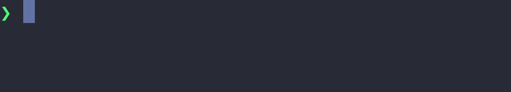

<h1 align="center">
  
  <br>
  <a href="https://opensource.org/licenses/MIT"></a>
  <a href="https://github.com/dimk90/s-vhs/actions/workflows/release.yml"></a>
  <a href="https://github.com/dimk90/s-vhs/tree/deploy"></a>
</h1>

<br>

A terminal recorder like [VHS](https://github.com/charmbracelet/vhs), but superior:

- **Always sharp** - no GIF quality loss
  ([#625](https://github.com/charmbracelet/vhs/issues/625),
  [#69](https://github.com/charmbracelet/vhs/issues/69#issuecomment-3121533232)).
- **No timing drift** - 1 second is 1 second at any resolution
  ([#69](https://github.com/charmbracelet/vhs/issues/69#issuecomment-3121533232)).
- **Sized in rows and cols** - no dancing with pixel width and height
  ([#578](https://github.com/charmbracelet/vhs/issues/578)).
- **Animated SVG output**
  ([#644](https://github.com/charmbracelet/vhs/discussions/644),
  [#109](https://github.com/charmbracelet/vhs/issues/109),
  [#105](https://github.com/charmbracelet/vhs/issues/105)).
- **No browser** - no headless Chromium downloaded behind your back, just
  `tmux` + [asciinema](https://github.com/asciinema/asciinema) with
  [agg](https://github.com/asciinema/agg) for GIF and
  [asg](https://github.com/kingsword09/asg) for SVG
  ([#528](https://github.com/charmbracelet/vhs/issues/528),
  [#438](https://github.com/charmbracelet/vhs/issues/438),
  [#150](https://github.com/charmbracelet/vhs/issues/150),
  [#45](https://github.com/charmbracelet/vhs/issues/45)).


## Quick Start


A recording is a plain shell script that sources `s-vhs.sh`:

```bash
#!/usr/bin/env bash

# Import s-vhs straight from GitHub - no local copy needed.
# A local copy works too, use "source ./s-vhs.sh"
source <(curl -fsSL https://dimk90.github.io/s-vhs/v0.3.0) && wait "$!" || exit 1

# Where should we write the GIF?
SetOutput 'demo.gif'

# Set up a 60x4 terminal with a 40px font
SetCols 60
SetRows 4
SetFontSize 40

# Start the terminal, then the recorder
Start
Show

# Type a command in the terminal
Type "echo 'Welcome to S-VHS!"
Sleep 1 # Pause for dramatic effect...

Type " Stay awhile and listen...'"
Sleep 1

# Run the command by pressing Enter
Enter

# Admire the output for a bit
Sleep 5

# Stop recording and write every requested output
Render
```

Save it as `demo.rec.sh`, make it executable and run it:
```bash
chmod +x demo.rec.sh
./demo.rec.sh
```

You should see a new file called `demo.gif` in the same directory:


## Installation

`s-vhs` is a bash script, so all you need are its dependencies `tmux` and `asciinema`:

```bash
sudo pacman -S tmux asciinema
```
> The provided instructions are for Arch Linux, but you can easily adapt them for your favorite distro ;)

Only the formats you request need their renderer - a cast-only recording
invokes neither, see [Output Formats](#output-formats).

- For GIF output, install
  [`agg`](https://github.com/asciinema/agg#building):
  ```bash
  cargo install --git https://github.com/asciinema/agg --locked
  ```
  > `agg` is not on crates.io (the `agg` crate there is an unrelated project),
  > hence the `--git` install.

- For animated SVG output, install
  [`asg`](https://github.com/kingsword09/asg#quick-start):
  ```bash
  cargo install asg --locked
  ```
  > `asg` reads asciicast v3 only, so SVG output also needs `asciinema` 3 or newer.

> [!TIP]
> Cargo installs both renderers into `~/.cargo/bin` - make sure it is on your
>  `PATH` (rustup's installer arranges that; a distro-packaged `cargo` does not).


## Examples

See [`examples`](examples) for the complete scripts behind the demos below, and a few more.

### Enter

```bash
Enter 4 0.5
```


### Type

```bash
# Regular typing
Type 'echo "whatever you want"'
Sleep 1

Enter; Sleep 0.5

# Slow typing
Type 'echo "slow down"' 0.25
```


### Columns & Rows

```bash
SetCols 40
SetRows 8

Type 'tput cols'
Enter; Sleep 1
Type 'tput lines'
Enter; Sleep 1
```


### Keys

Named keys are commands of their own: `Enter`, `Tab`, `Space`, `Backspace`,
`Escape`, `Up`, `Down`, `Left`, `Right`, `PageUp`, `PageDown`, `Home`, `End`,
`Insert`, `Delete`. Each taking an optional repeat count and delay. A modified
key goes through `Key` in tmux notation: `Key C-u`, `Key C-r`, `Key M-x`, see
[`examples/ctrl.rec.sh`](examples/ctrl.rec.sh).

#### Arrows

```bash
Type 'echo navigate around'; Sleep 0.5
Left 10 0.12
Sleep 0.5
Right 10 0.05
```


#### Backspace

```bash
Type 'echo delete anything...' 0.05; Sleep 0.5
Backspace 18 0.05
```


### Wait

`Wait` polls the visible pane until a grep pattern shows up, so a recording
keeps up with a slow command instead of guessing a `sleep`:

```bash
Type 'sleep 2 && echo "build succeeded"'
Enter

# Anchored: the pattern must match the output line, not the command echoed
# above it
Wait '^build succeeded'

Type 'echo "and on we go"'
```


### Color Theme

```bash
# One of the renderer's named themes.
# A comma-separated hex palette
# (background, foreground, then 8 or 16 colors) also works.
SetTheme 'kanagawa'
```


### Shell & Prompt

A recording runs in an isolated shell by default: no personal rc files, your
own prompt stays out of the frame, and nothing is written to your shell
history.

```bash
SetShell 'fish'       # bash (default), zsh or fish
SetPrompt 'powerline' # arrow (default), plain, path or powerline
SetTheme 'nord'       # the prompt picks up the theme's colors

# The theme follows the working directory
Type 'cd /tmp'
Enter; Sleep 1.5
Type 'cd ~'
Enter; Sleep 3
```


Every prompt theme is implemented for all three shells, so a recording looks
the same in bash, zsh and fish.

> [!TIP]
> `SetPrompt 'native'` records your own shell configuration instead, and
> any other value is taken as a literal prompt.

### Font Size

The font size is the only pixel-sized setting: it scales the whole render
without changing the terminal grid the recorded shell sees.

```bash
SetFontSize 40
```


### Hide / Show

```bash
Start # Start session / initialize terminal

# Off camera: export the variable and wipe the screen it was typed on
Run 'export HIDDEN=wow' 0.5
Run 'clear' 0.5

Show # Start recording

# The recorded shell expands it, not this script
Type 'echo $HIDDEN'
Enter; Sleep 2

Hide # Stop recording, the session keeps running

Run 'echo "nobody will ever see this"' 0.5
Run 'clear' 0.5

Show # Resume recording, appending to the same cast

Type 'echo "back on camera"'
Enter; Sleep 2
```


> [!TIP]
> `RunOffRecord 'clear' 0.5` is the shorthand for a `Hide` + `Run` + `Show`
> sandwich, see [`examples/run-off-record.rec.sh`](examples/run-off-record.rec.sh).

### Remote Import

Import an immutable release directly from GitHub via `curl` instead
of keeping a local `s-vhs.sh` next to the recording script:

```bash
# Remote import instead of "source ./s-vhs.sh"
source <(curl -fsSL https://dimk90.github.io/s-vhs/v0.3.0) && wait "$!" || exit 1

SetOutput "remote-import.gif"

Start
Show

Type "printf 'Imported s-vhs %s\\n' '$(svhs_version)'"
Enter; Sleep 3

Render
```

> [!NOTE]
> The `wait "$!"` is a guard: without it, process substitution can hide a
> failed or truncated `curl` download.

> [!TIP]
> Keep the version pinned so the same script always imports the same library.


### Animated SVG Output

```bash
SetOutput 'multi-output.cast'
SetOutput 'multi-output.gif'
SetOutput 'multi-output.svg' # <---
```

The `.svg` written by that [recording](examples/multi-output.rec.sh) -
animated by CSS, sharp at any zoom:




### S-VHS in the Wild

More than just a toy example:  
📌 [pi-context-view](https://github.com/dimk90/pi-context-view): demo GIFs,
such as [context-usage.rec.sh](https://github.com/dimk90/pi-context-view/blob/develop/scripts/recordings/context-usage.rec.sh).  
📌 [S-VHS logo recording](examples/logo.rec.sh).

## Output Formats

The extension of the path passed to `SetOutput` picks the format:

| Format  | Description                              | Render dependency                                       |
| ------- | ---------------------------------------- | ------------------------------------------------------- |
| `.cast` | Editable, replayable asciicast recording | None                                                    |
| `.gif`  | Animated raster image                    | [`agg`](https://github.com/asciinema/agg#installation)  |
| `.svg`  | Sharp, CSS-animated vector image         | [`asg`](https://github.com/kingsword09/asg#quick-start) |

`SetOutput` is repeatable - one recording, several outputs:

```bash
SetOutput 'multi-output.cast'
SetOutput 'multi-output.gif'
SetOutput 'multi-output.svg'
```

Keeping the `.cast` next to the rendered files leaves the recording replayable
with `asciinema play` and re-renderable at any size later — see
[`examples/multi-output.rec.sh`](examples/multi-output.rec.sh).


## Recording Template

Start a new recording without downloading `s-vhs.sh`:

```bash
curl -fsSL https://dimk90.github.io/s-vhs/latest | bash -s -- new demo.rec.sh
```
or if `s-vhs.sh` is already local:
```bash
./s-vhs.sh new demo.rec.sh
```

It writes:

```bash
#!/usr/bin/env bash

source <(curl -fsSL https://dimk90.github.io/s-vhs/v0.3.0) && wait "$!" || exit 1

SetOutput 'demo.gif'

# SetCols 100
# SetRows 40
# SetFontSize 28
# SetFontFamily 'JetBrains Mono'
# SetTheme 'dracula'
# SetTypingSpeed 0.07
# SetShell 'bash'
# SetPrompt 'arrow'

Start
Show

Type 'echo "Hello from s-vhs"'
Enter
Sleep 3

Render
```

## Documentation

- For the full list of commands and settings, see [REFERENCE.md](doc/REFERENCE.md).

- For debugging a recording script see [DEBUG.md](doc/DEBUG.md).

- For the architecture behind `tmux + asciinema + output renderers` and how
  `s-vhs` glues them together, see [INTRO.md](doc/INTRO.md).

  <p align="center">
    
  </p>

## License

[MIT](LICENSE)
