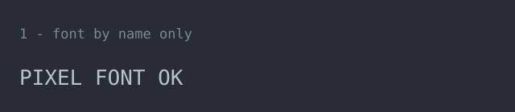
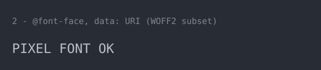
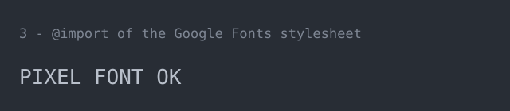
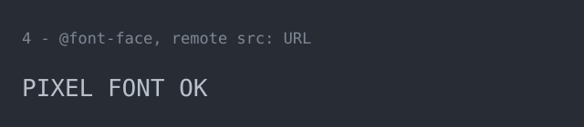

# SVG font-loading test

Scratch experiment, not user documentation. It answers one question:

> When Markdown renders an SVG, can that SVG get a font the reader does not
> have installed — and through which mechanism?

It matters because `asg` only *names* fonts, so an s-vhs SVG is finished on the
reader's machine, and because [`upstream/EMBED-FONT.md`](upstream/EMBED-FONT.md)
proposes a `data:` URI `@font-face` as the fix. Four SVGs below differ only in
how they try to obtain the same face.

## How to read the images

The test font is [Press Start 2P](https://fonts.google.com/specimen/Press+Start+2P)
(OFL) — a pixel face, deliberately nothing like a monospace fallback, and not
installed on the test machine (`fc-list | grep -c 'Press Start'` → `0`).

* Blocky 8-bit letters → the mechanism **worked**.
* Smooth monospace letters → the mechanism **failed**, fallback in use.

The grey label line is always plain `monospace`, so each image stays
identifiable when its sample line falls back.

Two gates are being tested at once, and they are separate:

1. **Image context.** Markdown renders SVG through ``, where browsers
   block every external resource —
   [MDN, *SVG as an image*](https://developer.mozilla.org/en-US/docs/Web/SVG/Guides/SVG_as_an_image):
   "External resources (e.g., images, stylesheets) cannot be loaded, though
   they can be used if inlined through `data:` URLs."
2. **GitHub's CSP.** The SVG response itself carries a policy with no
   `font-src`, so font loads fall back to `default-src 'none'`:

   ```console
   $ curl -sI https://raw.githubusercontent.com/dimk90/s-vhs/develop/doc/images/font-test/data-uri.svg | grep -i content-security-policy
   content-security-policy: default-src 'none'; style-src 'unsafe-inline'; sandbox
   ```

   `style-src 'unsafe-inline'` is why an asg animation runs at all on GitHub.
   The missing `font-src data:` is [github/markup#1164](https://github.com/github/markup/issues/1164),
   closed as not planned; same symptom in
   [excalidraw#4855](https://github.com/excalidraw/excalidraw/issues/4855).

Four contexts separate them. `local.html` is a harness that shows all four
variants side by side, once in `` and once in `<object>`:

| #   | Context         | How                                                                                          | Gates in play       |
| --- | --------------- | -------------------------------------------------------------------------------------------- | ------------------- |
| A   | Local document  | open `doc/images/font-test/data-uri.svg` from disk, or the `<object>` column of `local.html` | none                |
| B   | Local ``   | the `` column of `file:///…/doc/images/font-test/local.html`                            | image context       |
| C   | Raw URL         | open a `raw.githubusercontent.com` link below in a tab                                       | CSP                 |
| D   | GitHub Markdown | view this file on github.com after pushing                                                   | image context + CSP |

A says whether the engine supports the mechanism at all, B and C isolate one
gate each, D is the case that actually matters.

## 1 — font by name only

Control. No `@font-face` at all, exactly what `asg --font-family` produces.
Expected to fall back everywhere, since the face is not installed.



[raw](https://raw.githubusercontent.com/dimk90/s-vhs/develop/doc/images/font-test/by-name.svg)

## 2 — `@font-face` with a `data:` URI

The `EMBED-FONT.md` proposal: a 4.4 KB WOFF2 subset base64-encoded into the
file. No network access needed, so only the CSP can stop it.



[raw](https://raw.githubusercontent.com/dimk90/s-vhs/develop/doc/images/font-test/data-uri.svg)

## 3 — `@import` of the Google Fonts stylesheet

```css
@import url('https://fonts.googleapis.com/css2?family=Press+Start+2P&display=swap');
```

An external stylesheet *and* an external font. Expected to fail in both ``
and CSP contexts, and to work only in a local document.



[raw](https://raw.githubusercontent.com/dimk90/s-vhs/develop/doc/images/font-test/import-css.svg)

## 4 — `@font-face` with a remote `src:` URL

Same as 3 without the stylesheet round-trip — `src: url(https://fonts.gstatic.com/…woff2)`.



[raw](https://raw.githubusercontent.com/dimk90/s-vhs/develop/doc/images/font-test/remote-url.svg)

## Which browsers

Only the engine matters, so three browsers cover the field — Edge, Brave,
Opera and Vivaldi are Blink and add nothing over Chrome.

| Engine | Browser to use         | Why it is needed                                                                                                                                                                       |
| ------ | ---------------------- | -------------------------------------------------------------------------------------------------------------------------------------------------------------------------------------- |
| Gecko  | **Firefox**            | The known-strict one: [github/markup#1164](https://github.com/github/markup/issues/1164) reports it falling back to `default-src 'none'` for fonts where the others did not. Required. |
| Blink  | **Chrome / Chromium**  | The majority of README readers. Required.                                                                                                                                              |
| WebKit | **Safari** (macOS/iOS) | Third behaviour; the 2018 report says it passed. Optional — approximate with GNOME Web (Epiphany, WebKitGTK) if there is no Mac, and mark the row as an approximation.                 |

Run each browser in a normal window with default settings — no reader mode, no
content blocker, and hard-reload (Ctrl-Shift-R) after every push, since GitHub
serves raw assets through a CDN cache.

In Firefox the console prints a CSP violation for a blocked font, which
confirms *why* a cell failed; Chrome does not reliably surface violations from
an SVG image document, so judge it by the glyphs.

## Which cases to try

Nine cases per engine, in this order. Variant 2 is the decision; the rest are
controls that explain a failure.

| #   | Case                                   | What it settles                                                                          |
| --- | -------------------------------------- | ---------------------------------------------------------------------------------------- |
| 1   | **2D** — data URI, GitHub              | The whole question. Everything else only explains this cell.                             |
| 2   | **2B** — data URI, local ``       | Whether the image context alone blocks it (MDN says it should not).                      |
| 3   | **2C** — data URI, raw URL             | Whether GitHub's CSP alone blocks it. If 2B passes and 2C fails, the CSP is the culprit. |
| 4   | **2A** — data URI, local document      | Sanity check on the file itself. If this fails, the SVG is wrong, not the context.       |
| 5   | **1D** — by name, GitHub               | Calibration: this is what a failure looks like.                                          |
| 6   | **3A** — `@import`, local document     | Whether a remote import can ever work.                                                   |
| 7   | **3D** — `@import`, GitHub             | Confirms it cannot in a README.                                                          |
| 8   | **4A** — remote `src:`, local document | Same as 6 without the stylesheet hop.                                                    |
| 9   | **4D** — remote `src:`, GitHub         | Same as 7.                                                                               |

Skip 1A–1C (nothing to load), 3B/3C and 4B/4C unless 3D or 4D surprisingly
passes.

## Results

`✅` = blocky pixel font, `❌` = smooth monospace fallback. Fill the three
engine columns; the prediction column is what the sources above imply, so any
mismatch is the interesting finding.

| Case                             | Predicted                              | Firefox | Chrome | Safari |
| -------------------------------- | -------------------------------------- | ------- | ------ | ------ |
| 2D data URI, GitHub              | ❓ split: ❌ Firefox, ✅ Chrome/Safari |         |        |        |
| 2B data URI, local ``       | ✅                                     |         |        |        |
| 2C data URI, raw URL             | ❓ same split as 2D                    |         |        |        |
| 2A data URI, local document      | ✅                                     |         |        |        |
| 1D by name, GitHub               | ❌                                     |         |        |        |
| 3A `@import`, local document     | ✅                                     |         |        |        |
| 3D `@import`, GitHub             | ❌                                     |         |        |        |
| 4A remote `src:`, local document | ✅                                     |         |        |        |
| 4D remote `src:`, GitHub         | ❌                                     |         |        |        |

Measured already, on this machine — no browser, so these are the non-browser
renderers only:

| Renderer                 | 1 by name | 2 `data:` URI                                         |
| ------------------------ | --------- | ----------------------------------------------------- |
| `rsvg-convert` (librsvg) | ❌        | ❌ (pixel-identical to 1, `compare -metric AE` → `0`) |
| `resvg`                  | ❌        | ❌                                                    |

Both ignore `@font-face` entirely — worth remembering for any non-browser
consumer of an s-vhs SVG (Inkscape, ImageMagick, editor previews).

## What the outcome decides

* **2 works on GitHub** → `--embed-font` upstream is the whole fix, and
  `EMBED-FONT.md` stands as written.
* **2 fails on GitHub but works locally / at the raw URL** → the claim in
  `EMBED-FONT.md` ("browsers honour data-URI `@font-face` even for SVG loaded
  through ``, which is the GitHub README case") needs qualifying: it fixes
  every context *except* the README that motivates it, and GIF stays the only
  option there.
* **3 or 4 works anywhere but a local document** → a remote import would be a
  cheaper alternative worth proposing instead. Not expected.

## Regenerating the assets

```bash
curl -sLo /tmp/ps2p.ttf https://github.com/google/fonts/raw/main/ofl/pressstart2p/PressStart2P-Regular.ttf
pyftsubset /tmp/ps2p.ttf --text='PIXELFONTOK ' --output-file=/tmp/sub.ttf
woff2_compress /tmp/sub.ttf          # 10,709 -> 4,294 bytes, 4.4 KB on disk
base64 -w0 /tmp/sub.woff2            # inlined into data-uri.svg
```

The subset keeps the `name` table, so the OFL notice travels with it
(`strings -el /tmp/sub.ttf | grep Copyright`).
